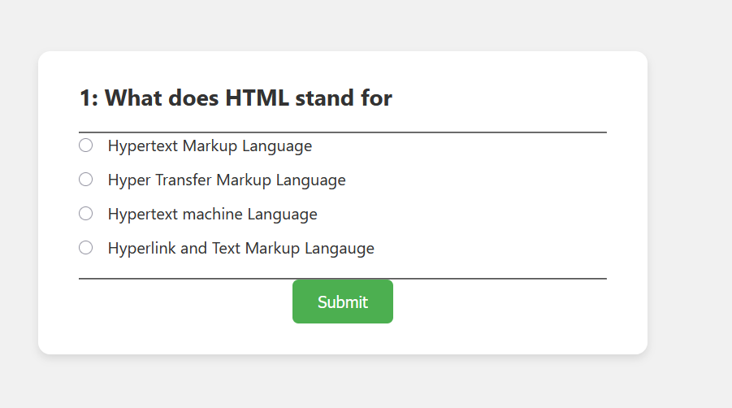
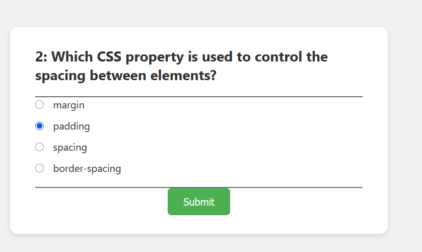
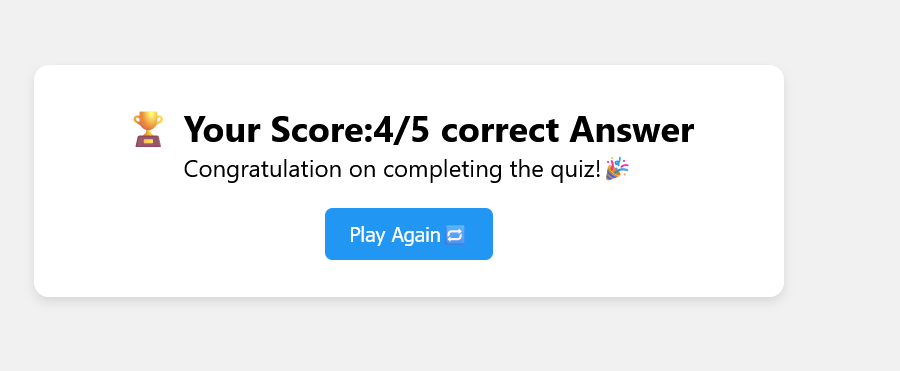

# 🧠 QuizMasterJS

> A responsive and interactive JavaScript quiz web app to test your frontend skills.
> 

---
## 🖼️ Screenshots

### ▶️ Start Screen

### 🧩 Quiz in Progress

### 🏁 Result Screen

## 📌 About the Project

**QuizMasterJS** is a browser-based quiz application built using **HTML**, **CSS**, and **Vanilla JavaScript**.  
It features multiple-choice questions, dynamic rendering, real-time score tracking, and a final result screen.

This project is perfect for frontend beginners to learn DOM manipulation, event handling, and project structuring.

---

## 🚀 Features

- 🔘 Multiple-choice questions
- 📊 Real-time score calculation
- 🔄 "Play Again" feature
- 📱 Responsive and clean UI
- 💡 Beginner-friendly codebase

---

## 📁 Project Structure

